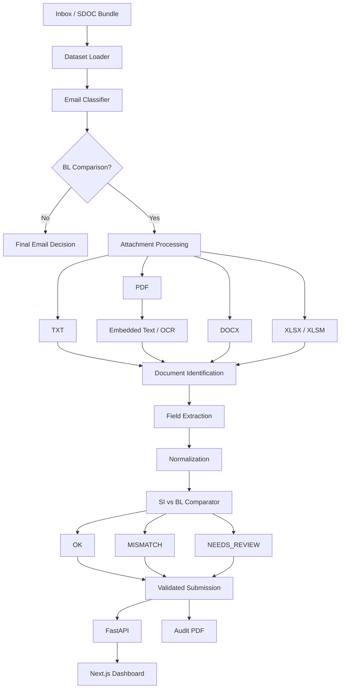

# Docport — Averis Shipping Intelligence

<p align="center">
  <b>Fast, deterministic and auditable shipping-document verification.</b>
</p>

<p align="center">
  Automatically classify shipping emails, identify documents, extract structured fields, compare Shipping Instructions against Bills of Lading, and surface discrepancies for human review.
</p>

<p align="center">
  
  
  
  
  
  
</p>

---

## Overview

**Docport** is the repository behind **Averis Shipping Intelligence**, a document-verification system built for the SDOC shipping document challenge.

Shipping teams can receive hundreds or thousands of emails containing Shipping Instructions, Bills of Lading, invoices, spreadsheets, scanned PDFs, and unrelated messages.

Manually checking every document is slow and error-prone.

Docport turns that workflow into a deterministic pipeline:

```text
Email
  ↓
Classification
  ↓
Attachment Extraction
  ↓
Document Identification
  ↓
Field Extraction
  ↓
Normalization
  ↓
SI ↔ BL Comparison
  ↓
Decision + Evidence
  ↓
Dashboard / JSON / Audit Report
```

Instead of producing an unexplained score, the system keeps the evidence behind each decision and routes uncertain cases to human review.

---

# Key Features

### Email Classification

Every email is assigned exactly one category:

* `BL_COMPARISON`
* `SI_REQUEST`
* `INVOICE_QUERY`
* `GENERAL`
* `SPAM`

Classification is deterministic and based on evidence present in the supplied email data.

---

### Multi-format Document Processing

Docport can process shipping information from:

| Format      | Processing                     |
| ----------- | ------------------------------ |
| TXT         | Direct text extraction         |
| PDF         | Embedded text extraction       |
| Scanned PDF | Tesseract OCR fallback         |
| DOCX        | Paragraph and table extraction |
| XLSX / XLSM | Worksheet and cell extraction  |

Extracted content is converted into a common text representation before passing through the same document-detection and comparison pipeline.

This keeps document interpretation independent from the original file format.

---

### Content-first Document Identification

A filename like:

```text
shipment_BL_final.pdf
```

is not automatically trusted.

Docport inspects the actual contents of the attachment and looks for evidence that the document is a:

* Shipping Instruction
* Bill of Lading
* Invoice
* Packing List
* Certificate of Origin
* Other / unknown document

Content evidence is intentionally treated as stronger than filename hints.

This prevents badly named files from silently producing incorrect comparisons.

---

## SI ↔ BL Verification

For Bill of Lading comparison emails, Docport extracts and compares seven canonical shipping fields:

```text
shipper
consignee
notify_party
port_of_loading
port_of_discharge
container_count
gross_weight_kg
```

Values are normalized before comparison to reduce false discrepancies caused by formatting differences.

Example:

```text
SI:  12,500 KG
BL:  12500 kg
```

Normalizes to the same value.

---

# Decision Model

A comparison produces one of three outcomes.

| Status         | Meaning                                    |
| -------------- | ------------------------------------------ |
| `OK`           | All required normalized values agree       |
| `MISMATCH`     | One or more fields disagree                |
| `NEEDS_REVIEW` | A safe automated comparison cannot be made |

Possible review reasons include:

```text
wrong_doc_type
missing_attachment
unreadable
missing_value
```

A critical design rule is:

> Uncertainty is not treated as a defect.

If the system cannot safely determine whether two documents disagree, it returns:

```json
{
  "status": "NEEDS_REVIEW",
  "has_defect": false,
  "defect_fields": []
}
```

rather than fabricating a mismatch.

---

# Why Docport?

## 1. Deterministic by Design

The core verification pipeline does not rely on an LLM to decide whether documents match.

Given the same input, the system produces the same result.

That makes decisions:

* reproducible
* testable
* debuggable
* auditable

---

## 2. Evidence-first Decisions

Docport preserves the reasoning behind document selection and verification.

For an individual email, the system can expose:

```text
Email classification
↓
Classification evidence
↓
Detected attachments
↓
Detected document types
↓
Raw extracted values
↓
Normalized values
↓
Compared fields
↓
Final decision
```

This makes it possible for a reviewer to understand **why** a document was flagged.

---

## 3. Human Review Instead of Guessing

Real shipping documents are messy.

Attachments can be:

* missing
* corrupted
* incorrectly named
* scanned badly
* incomplete
* ambiguous

Rather than forcing a prediction, Docport explicitly routes unsafe cases to `NEEDS_REVIEW`.

---

## 4. Built for Throughput

The pipeline supports deterministic parallel processing:

```bash
--workers 8
```

Attachments are loaded once and processing can be distributed across workers while preserving output order and decision consistency.

Performance can be measured directly using:

```bash
--benchmark
```

Example output:

```text
Loaded: 520 emails
Processed: 520
BL comparisons: 143
Needs review: 7

Load time: ...
Processing time: ...
Total time: ...
Throughput: ... emails/sec
```

Benchmark values are measured at runtime rather than hard-coded.

---

## 5. End-to-end Auditability

Docport can produce both machine-readable output and human-readable PDF audit reports.

This allows the same pipeline to support:

```text
Automation
   +
Operations Dashboard
   +
Human Review
   +
Audit / Compliance
```

without creating separate decision systems.

---

# Architecture



---

# Dashboard

Averis includes a web dashboard for inspecting verification results.

The dashboard can display:

* total processed emails
* number of BL comparisons
* successful comparisons
* mismatches
* review-required cases
* processing runtime
* throughput
* classification distribution
* email search and filtering
* per-email verification evidence
* human-review queue
* audit report generation

The frontend is built with:

```text
Next.js 15
React 19
TypeScript
Tailwind CSS
Recharts
Framer Motion
Lucide
```

---

# Tech Stack

### Verification Engine

* Python 3.11+
* Standard library processing core
* `pypdf`
* `pypdfium2`
* `pytesseract`
* `Pillow`
* `python-docx`
* `openpyxl`

### Backend

* FastAPI
* Uvicorn

### Frontend

* Next.js
* React
* TypeScript
* Tailwind CSS
* Recharts
* Framer Motion

### Reporting

* ReportLab

### Infrastructure

* Docker
* Docker Compose
* Pytest

---

# Project Structure

```text
Docport/
│
├── classifier.py
│   └── Deterministic email classification
│
├── dataset_loader.py
│   └── SDOC Inbox and dataset loading
│
├── inbox_adapter.py
│   └── Converts inbox records and attachments into internal models
│
├── document_handler.py
│   └── Content-first SI / BL document identification
│
├── pdf_text.py
│   └── PDF text extraction and OCR handling
│
├── docx_text.py
│   └── Word document text and table extraction
│
├── xlsx_text.py
│   └── Spreadsheet extraction
│
├── extractor.py
│   └── Canonical shipping-field extraction
│
├── normalizer.py
│   └── Conservative value normalization
│
├── comparator.py
│   └── SI vs BL comparison logic
│
├── pipeline.py
│   └── Pipeline orchestration and parallel execution
│
├── models.py
│   └── Core typed data structures
│
├── submission.py
│   └── Submission generation and validation
│
├── explanation.py
│   └── Human-readable decision explanations
│
├── audit_report.py
│   └── PDF audit report generation
│
├── main.py
│   └── CLI and processing API
│
├── dashboard_api.py
│   └── Averis dashboard API
│
├── frontend/
│   └── Next.js operations dashboard
│
├── tests/
│   └── Unit and end-to-end tests
│
├── demo_data/
│   └── Self-contained demonstration dataset
│
├── Dockerfile
├── Dockerfile.api
├── docker-compose.yml
└── requirements.txt
```

---

# Quick Start

## Option 1 — Docker Compose

The easiest way to run the full Averis stack is with Docker.

### Clone the repository

```bash
git clone https://github.com/ronxmi3/Docport.git
cd Docport
```

### Start the system

```bash
docker compose up --build
```

Once the containers are running:

```text
Dashboard
http://localhost:3000

API
http://localhost:8000

FastAPI Docs
http://localhost:8000/docs
```

The included Docker configuration uses the bundled `demo_data` dataset by default.

Generated output is written to:

```text
./output/
```

---

# Running the Verification Engine Locally

## 1. Clone

```bash
git clone https://github.com/ronxmi3/Docport.git
cd Docport
```

## 2. Create a virtual environment

### Windows

```powershell
python -m venv .venv
.\.venv\Scripts\activate
```

### macOS / Linux

```bash
python3 -m venv .venv
source .venv/bin/activate
```

## 3. Install dependencies

```bash
pip install -r requirements.txt
```

For development and testing:

```bash
pip install -r requirements-dev.txt
```

---

# OCR Setup

Scanned PDFs require **Tesseract OCR**.

Docker installs Tesseract automatically.

For local Windows development, install Tesseract and ensure:

```text
tesseract.exe
```

is available on your system `PATH`.

If OCR cannot safely extract a document, the pipeline routes the email to:

```text
NEEDS_REVIEW / unreadable
```

rather than attempting an unsafe comparison.

---

# Dataset Layout

The pipeline can operate on the SDOC participant bundle:

```text
sdoc-hackathon-bundle/
│
├── attachments/
│
├── inbox/
│   ├── email_001.json
│   ├── email_002.json
│   └── ...
│
├── sample_submission.json
├── loader.py
└── README.md
```

The supplied `loader.py` / `Inbox` abstraction is used when available.

A direct folder-layout fallback is also supported.

---

# Run the Pipeline

```bash
python main.py \
  --source "/path/to/sdoc-hackathon-bundle" \
  --output submission.json
```

Windows example:

```powershell
python main.py --source "C:\path\to\sdoc-hackathon-bundle" --output submission.json
```

---

# Parallel Processing

```bash
python main.py \
  --source "/path/to/sdoc-hackathon-bundle" \
  --output submission.json \
  --workers 8 \
  --benchmark
```

Parallel execution does not change output ordering or verification decisions.

---

# Inspect a Single Email

For debugging or demonstrations:

```bash
python main.py \
  --source "/path/to/sdoc-hackathon-bundle" \
  --email email_004 \
  --verbose
```

This displays information including:

```text
classification
attachment evidence
document identification
raw extracted fields
normalized fields
comparison result
review reason
processing time
```

---

# Explain a Decision

```bash
python main.py \
  --source "/path/to/sdoc-hackathon-bundle" \
  --email email_004 \
  --verbose \
  --explain
```

This generates a human-readable explanation using evidence already recorded by the pipeline.

---

# Generate an Audit Report

Generate a full report:

```bash
python main.py \
  --source "/path/to/sdoc-hackathon-bundle" \
  --output output/submission.json \
  --workers 8 \
  --report output/decision_report.pdf
```

Generate a report containing only problem cases:

```bash
python main.py \
  --source "/path/to/sdoc-hackathon-bundle" \
  --output output/submission.json \
  --workers 8 \
  --report output/problems_only.pdf \
  --report-only-problems
```

Reports are presentation-only.

Generating a report does **not** rerun verification or modify the underlying decision.

---

# Dashboard API

The Averis dashboard API exposes the verification engine through FastAPI.

### Health

```http
GET /api/health
```

### System summary

```http
GET /api/summary
```

### Search / filter emails

```http
GET /api/emails
```

Supported filters include:

```text
query
category
status
review_reason
```

### Inspect one email

```http
GET /api/emails/{email_id}
```

### Human review queue

```http
GET /api/review
```

### Run verification

```http
POST /api/run
```

### Check audit report

```http
GET /api/report
```

### Generate audit report

```http
POST /api/report
```

### Download audit report

```http
GET /api/report/download
```

---

# Run the API Directly

```bash
uvicorn dashboard_api:app --host 0.0.0.0 --port 8000
```

Then visit:

```text
http://localhost:8000/docs
```

for the automatically generated OpenAPI interface.

---

# Run the Frontend Locally

```bash
cd frontend
npm install
npm run dev
```

Open:

```text
http://localhost:3000
```

The frontend expects the API at:

```text
http://localhost:8000
```

by default.

---

# Testing

Run the complete Python test suite:

```bash
python -m pytest -q
```

Tests cover areas including:

* email classification
* classification aliases
* document identification
* attachment handling
* field extraction
* normalization
* zero, one and multiple discrepancies
* missing attachments
* incorrect document types
* missing values
* malformed content
* deterministic parallel execution
* submission validation
* end-to-end bundle processing

---

# Docker

## Build the verification image

```bash
docker build -t sdoc-pipeline:latest .
```

## Build the test image

```bash
docker build --target test -t sdoc-pipeline:test .
```

## Run tests

```bash
docker run --rm sdoc-pipeline:test
```

---

# Docker With Your Own Dataset

Create an output directory:

```powershell
New-Item -ItemType Directory -Force .\output | Out-Null
```

Run:

```powershell
docker run --rm `
  -v "C:\path\to\sdoc-hackathon-bundle:/data:ro" `
  -v "${PWD}\output:/output" `
  sdoc-pipeline:latest `
  --source /data `
  --output /output/submission.json `
  --workers 8 `
  --benchmark
```

The participant dataset is mounted as **read-only**.

Only the output directory is writable by the container.

---

# Safety Philosophy

Docport follows one central rule:

> **Do not create certainty where the source documents do not provide it.**

If an attachment is unreadable, ambiguous, missing, or incomplete, the pipeline escalates it instead of guessing.

This allows automation to handle routine comparisons while keeping humans responsible for uncertain cases.

---

# Example Verification

```text
EMAIL
email_042

        │
        ▼

CLASSIFICATION
BL_COMPARISON

        │
        ▼

ATTACHMENTS
shipping_instruction.docx
draft_bl.pdf

        │
        ▼

DOCUMENT IDENTIFICATION
SI ✓
BL ✓

        │
        ▼

FIELD COMPARISON

Shipper ................. MATCH
Consignee ............... MATCH
Notify Party ............ MATCH
Port of Loading ......... MATCH
Port of Discharge ....... MATCH
Container Count ......... MATCH
Gross Weight ............ MISMATCH

        │
        ▼

FINAL DECISION

MISMATCH

defect_fields:
["gross_weight_kg"]
```

The reviewer sees the exact field responsible for the failure instead of receiving only a generic error.

---
## Docker Integration

DocPort is fully containerized using Docker.

The project includes:

- `Dockerfile` — reproducible Python pipeline and test environment
- `Dockerfile.api` — containerized FastAPI backend
- `docker-compose.yml` — orchestrates the DocPort frontend and backend services
- Tesseract OCR is installed inside the backend container, so scanned PDF processing does not depend on the host machine's OCR installation

### Run DocPort with Docker

From the project root:

```bash
docker compose up --build

# Future Improvements

Possible extensions include:

* distributed worker execution
* queue-based inbox ingestion
* live email-provider integration
* persistent audit history
* reviewer authentication and roles
* reviewer feedback workflows
* document-preview integration
* expanded OCR support for image attachments
* additional shipping-document types
* operational monitoring and alerting

The processing core is deliberately separated from the dashboard and API layers so these capabilities can be added without rewriting the verification logic.

---

# Repository

GitHub:

https://github.com/ronxmi3/Docport

---

## Built for the SDOC Shipping Document Verification Challenge

Docport demonstrates how high-volume shipping-document verification can be automated while keeping decisions deterministic, inspectable, and safe to escalate when the available evidence is insufficient.
